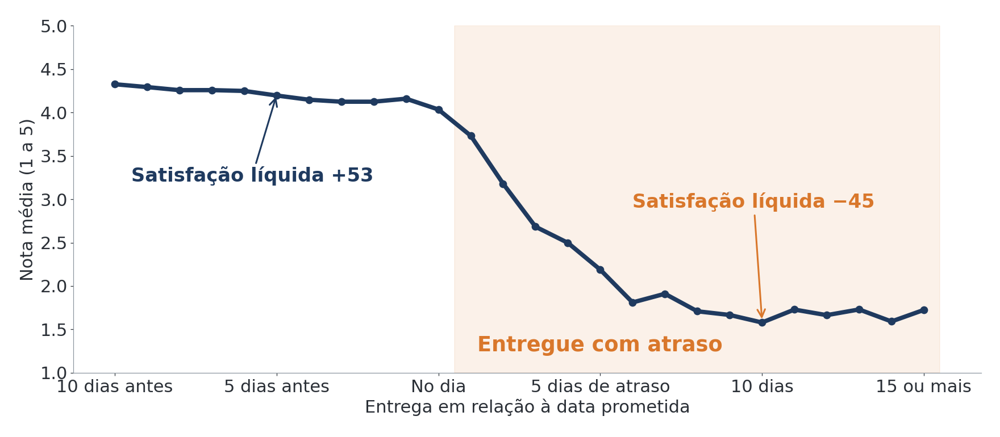
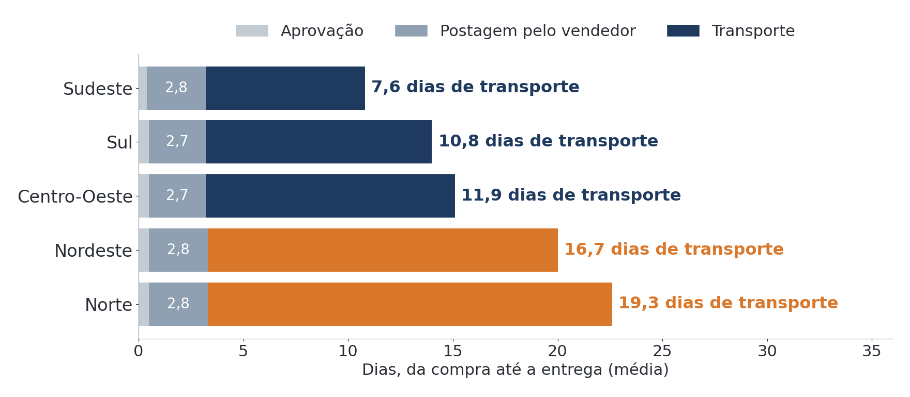
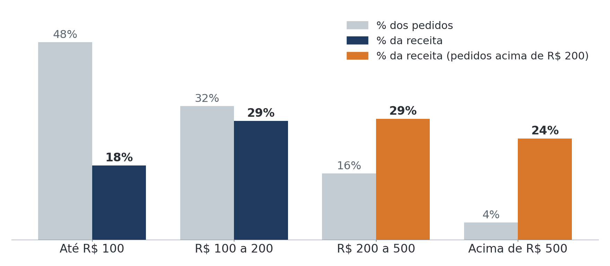

# Case Olist — Board Executivo para Decisão Estratégica

> Cerca de 100 mil pedidos de um marketplace brasileiro transformados em **três decisões para o CEO**, e não em um notebook com 40 gráficos.

**Autora:** Gabriela Piccinini  
**Curso:** MBA em Gestão Estratégica, Excelência Operacional e Métodos Ágeis — Frons Educação  
**Disciplina:** Análise de dados para tomada de decisões estratégicas (MBAGESTAO) — Professor Bruno César  
**Repositório:** https://github.com/gpiccininicardoso/case-olist-board-executivo

---

## As três perguntas do CEO

1. **Onde perdemos dinheiro?**
2. **Onde investir?**
3. **O que o cliente está dizendo?**

## Resumo executivo: os três achados

### 1. Um pedido atrasado transforma cliente satisfeito em detrator: a satisfação líquida vai de +53 para −45

A cada dia de atraso, a nota média cai **0,26 ponto**. Entre os pedidos atrasados, 62% recebem nota 1 ou 2, contra 9% dos entregues no prazo.

**Recomendação:** alerta de pedidos em risco de atraso, com aviso proativo ao cliente, começando pelo Nordeste (9% dos pedidos e 18% dos atrasos). **Meta:** atrasos de 6,8% para 3,4%.

### 2. No Nordeste, o transporte leva 17 dias, mais que o dobro do Sudeste, embora o vendedor poste no mesmo prazo

O vendedor posta em 2,8 dias em todas as regiões; a diferença está no transporte, que responde por 83% do tempo de entrega no Nordeste. Apenas 4,6% dos itens comprados na região são vendidos por vendedores locais.

**Recomendação em duas fases:**
- **Fase 1 — rever a operação logística atual:** transportadoras e rotas de BA, PE e CE (68% dos pedidos da região). **Meta:** transporte de 17 para 12 dias; atrasos de 12,8% para 8%.
- **Fase 2 — estudo de viabilidade de um centro de distribuição** em Salvador ou Recife, caso a Fase 1 não atinja as metas.

### 3. Pedidos acima de R$ 200 são 20% das vendas, mas geram 53% da receita

71% desses pedidos são parcelados no cartão; acima de R$ 500, 92% são parcelados, com média de 7 parcelas.

**Recomendação:** testar parcelamento sem juros em um grupo de categorias de maior valor e medir o efeito no ticket médio (hoje R$ 160).

---

## Arquivos do repositório

| Tipo | Arquivos |
|---|---|
| Board e entregáveis (PDF) | [05_Board_Executivo.pdf](05_Board_Executivo.pdf) · [01_Mapa_de_Indicadores.pdf](01_Mapa_de_Indicadores.pdf) · [02_Preparacao_dos_Dados.pdf](02_Preparacao_dos_Dados.pdf) · [03_Hipoteses_Testadas.pdf](03_Hipoteses_Testadas.pdf) · [04_Achados_Prioritarios.pdf](04_Achados_Prioritarios.pdf) |
| Notebooks reproduzíveis | [01_preparacao_dados.ipynb](01_preparacao_dados.ipynb) (junção das 9 tabelas, tratamento e variáveis derivadas) · [02_analise_exploratoria.ipynb](02_analise_exploratoria.ipynb) (4 hipóteses testadas) |
| Gráficos | Arquivos `.png` usados no board e neste README |

**Comece pelo [board executivo](05_Board_Executivo.pdf):** são 7 slides com as respostas às três perguntas do CEO.

## Como rodar

1. Abra os notebooks no **Google Colab** (*Arquivo → Fazer upload de notebook*) ou no Jupyter.
2. Execute todas as células em ordem, começando pelo `01`.
3. Os dados são baixados automaticamente do Kaggle: [Brazilian E-Commerce Public Dataset by Olist](https://www.kaggle.com/datasets/olistbr/brazilian-ecommerce). Se preferir, coloque os 9 arquivos CSV em `data/raw/`.
4. O notebook `01` gera as bases tratadas em `data/processed/`. O `02` usa essas bases ou, se elas não existirem, refaz a preparação com as mesmas regras.

A pasta `data/` não é versionada: os dados originais pertencem à Olist e estão disponíveis publicamente no Kaggle.

## Indicadores escolhidos

| Pergunta do CEO | Indicador | Fórmula | Linha de base |
|---|---|---|---|
| Onde perdemos dinheiro? | Taxa de atraso | Pedidos entregues após a data prometida ÷ pedidos entregues | 6,8% |
| | Peso do frete | Frete ÷ (produtos + frete) | 14,3% |
| | Perda por cancelamento | Pedidos cancelados ou indisponíveis ÷ total | 1,2% |
| Onde investir? | Receita por categoria | Soma do valor dos produtos por categoria | 10 categorias = 63% |
| | Ticket médio | Receita ÷ número de pedidos | R$ 160 |
| | Taxa de recompra | Clientes com 2+ pedidos ÷ total de clientes | 3,0% |
| O que o cliente diz? | Satisfação líquida | % de notas 5 − % de notas 1 e 2 | +46 |

Custo de aquisição de cliente e margem de lucro ficaram de fora porque a base não traz gastos com marketing nem custo dos produtos.

## Hipóteses testadas

| Hipótese | Resultado | Número-chave |
|---|---|---|
| O atraso na entrega derruba a nota do cliente | Confirmada | −0,26 ponto por dia de atraso |
| O frete pesa mais para clientes do Norte e Nordeste | Confirmada | 28% do pedido no Norte vs. 19,5% no Sudeste |
| O parcelamento se concentra nos pedidos de valor alto | Confirmada | 92% parcelam acima de R$ 500 |
| O Nordeste cresce mais rápido que o Sudeste | **Refutada** | Sudeste +150% vs. Nordeste +120% |

## Decisões metodológicas

| Situação | Decisão | Motivo |
|---|---|---|
| Meses de 2016 e set/out de 2018 com poucos pedidos | Período analisado: jan/2017 a ago/2018 | Evitar distorção em médias e tendências |
| Pedido com vários itens e pagamentos | Itens e pagamentos resumidos por pedido antes da junção | Não contar o mesmo valor mais de uma vez |
| Pedidos sem data de entrega | Mantidos; excluídos só dos cálculos de prazo | Continuam válidos para receita e cancelamento |
| Pedido com mais de uma avaliação | Mantida a mais recente | Uma opinião por pedido |
| 610 produtos sem categoria | Categoria `sem_categoria` | Não perder receita nas somas |
| 1 milhão de coordenadas, 261 mil repetidas | Uma coordenada média por prefixo de CEP | Calcular a distância vendedor → cliente |
| Receita | Produtos + frete (o valor pago inclui juros e vouchers) | Medida estável e comparável |
| Queda da nota por dia de atraso | Regressão linear nos atrasos de 1 a 10 dias | Traduzir a relação em linguagem de negócio |

## Dicionário de dados

### `base_pedidos.csv` — uma linha por pedido (99.092 pedidos)

| Coluna | Descrição |
|---|---|
| `order_id` | Identificador do pedido |
| `customer_unique_id` | Identificador único do cliente (usado para recompra) |
| `customer_state` / `regiao` | Estado e região do cliente |
| `order_status` | Situação do pedido |
| `order_purchase_timestamp` | Data e hora da compra |
| `order_estimated_delivery_date` | Data de entrega prometida |
| `order_delivered_customer_date` | Data real de entrega |
| `ano_mes` | Mês da compra |
| `valor_produtos` / `valor_frete` | Soma do preço e do frete dos itens (R$) |
| `receita_bruta` | Produtos + frete (R$) |
| `receita_liquida` | Receita bruta − frete (R$) |
| `peso_frete` | Frete ÷ receita bruta |
| `valor_pago` | Total pago (inclui juros e vouchers) |
| `forma_pagamento` / `parcelas` | Forma de pagamento principal e número de parcelas |
| `dias_entrega` | Dias entre a compra e a entrega |
| `prazo_prometido_dias` | Dias entre a compra e a data prometida |
| `dias_atraso` | Entrega real − data prometida (positivo = atraso) |
| `atrasado` | Verdadeiro quando o pedido chegou depois do prometido |
| `entregue` / `cancelado` | Indicadores de situação |
| `review_score` | Nota da avaliação (1 a 5) |
| `avaliacao_ruim` / `avaliacao_otima` | Nota 1–2 / nota 5 |

### `base_itens.csv` — uma linha por item vendido (112.279 itens)

| Coluna | Descrição |
|---|---|
| `order_id` / `order_item_id` | Pedido e posição do item |
| `product_id` / `categoria` | Produto e categoria padronizada |
| `seller_id` / `seller_state` / `regiao_vendedor` | Vendedor, estado e região |
| `customer_state` / `regiao_cliente` | Estado e região do cliente |
| `price` / `freight_value` | Preço e frete do item (R$) |
| `peso_frete` | Frete ÷ (preço + frete) |
| `mesmo_estado` | Verdadeiro quando vendedor e cliente estão no mesmo estado |
| `distancia_km` | Distância em linha reta vendedor → cliente |

## Limitações

- **Dados até 2018:** não captam as mudanças do comércio eletrônico após a pandemia.
- **Sem custos:** não há custo de produto, operação ou marketing; por isso margem e custo de aquisição não foram calculados, e o centro de distribuição depende de estudo de viabilidade.
- **Associação não é causa:** as análises mostram relações entre fatores; as recomendações foram desenhadas como testes com metas.
- **Satisfação líquida é uma adaptação do NPS**, calculada sobre a nota de 1 a 5, e não sobre a pergunta de recomendação de 0 a 10.
- **Distância em linha reta**, não a rota real percorrida.
- **Comentários em português:** o texto das avaliações exigiria tratamento de linguagem específico e não foi usado nesta versão.

## Próximos passos da análise

- Analisar o texto dos comentários para identificar os motivos das notas baixas.
- Medir o desempenho por transportadora, caso esse dado seja disponibilizado.
- Estimar o custo do centro de distribuição com dados de mercado para completar o estudo de viabilidade.

---

*Dados: Olist, publicados no Kaggle sob licença CC BY-NC-SA 4.0. Trabalho acadêmico, sem vínculo com a empresa.*
